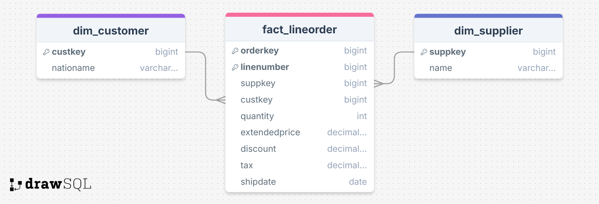

# **OLAP-ETL with Apache NiFi & Spark**  

## **Overview**  
This project demonstrates an **ETL (Extract, Transform, Load) pipeline** for converting an **OLTP relational schema** into an **OLAP star schema** using **Apache NiFi**, **MySQL**, and **Apache Spark**. The transformation optimizes query performance for analytical processing.

Full report can be found . 

## **Technologies Used**  
- **MySQL** – Source OLTP database  
- **Apache NiFi** – ETL pipeline for data extraction and transformation  
- **Apache Spark** – OLAP engine for querying the star schema  
- **TPC-H Dataset** – Benchmark dataset for analytical queries  

## **Project Structure**  
```plaintext
├── data/                # TPC-H dataset generated with dbgen
├── sql/                 # SQL scripts for OLTP & Star Schema
├── nifi/                # Apache NiFi flow templates
├── benchmarks/          # Execution time analysis for MySQL & Spark
└── README.md            # Project documentation
```

## **Setup Guide**  

### **Step 1: Generate TPC-H Data**  
```bash
git clone https://github.com/electrum/tpch-dbgen.git
cd tpch-dbgen
make -f makefile.suite
mkdir data && cd data
cp ../dbgen .
cp ../dists.dss .
./dbgen -s 1   # Generate 1GB dataset
```

### **Step 2: Set Up MySQL & Load Data**  
```sql
CREATE DATABASE tpch;
USE tpch;
-- Run OLTP schema SQL script
SOURCE sql/oltp_schema.sql;
-- Load TPC-H data
LOAD DATA LOCAL INFILE 'data/region.tbl' INTO TABLE region FIELDS TERMINATED BY '|' LINES TERMINATED BY '\n';
```

### **Step 3: Install Apache NiFi**  
Follow the installation guide: [Apache NiFi Official Site](https://nifi.apache.org/download.html).  

### **Step 4: Run the NiFi ETL Pipeline**  
- Start NiFi:  
  ```bash
  ./nifi.sh start
  ```
- Import the flow from `nifi/etl_flow.xml`  
- Configure MySQL connection  
- Run the pipeline to extract, transform, and load data into **Parquet files**  

### **Step 5: Install Apache Spark & Query the Star Schema**  
```bash
pip install pyspark
spark-submit sql/query_star_schema.py
```

## **Star Schema Design**  
The **OLTP schema** was transformed into a **star schema** for optimized analytical queries:

### **Full Star Schema**
This schema represents the **full star schema**, following best practices for transforming OLTP tables into an OLAP structure. It adheres to the core principles of dimensional modeling, ensuring that dimensions reflect real-world entities based on the fundamental questions: **Who, When, Where, What, and How**.

  

#### **Fact Table: `fact_lineorder`**  
This table stores transactional data at the **line item level**.  
| Column         | Type          | Description                     |
|---------------|--------------|---------------------------------|
| orderkey      | INT       | Unique order identifier        |
| linenumber    | INT       | Line item number within order  |
| partkey       | INT       | Foreign key to `dim_part`      |
| suppkey       | INT       | Foreign key to `dim_supplier`  |
| custkey       | INT       | Foreign key to `dim_customer`  |
| shipdatekey   | INT       | Foreign key to `dim_date`      |
| quantity      | INT          | Ordered quantity               |
| extendedprice | DECIMAL      | Price before discount          |
| discount      | DECIMAL      | Discount applied               |
| tax           | DECIMAL      | Tax amount                     |

#### **Dimension Tables**  
Each dimension provides descriptive attributes to support analytical queries.

##### **`dim_customer`**  
| Column        | Type    | Description                     |
|--------------|--------|---------------------------------|
| custkey      | INT  | Unique customer identifier     |
| name         | VARCHAR | Customer name                  |
| address      | VARCHAR | Customer address               |
| nationname   | VARCHAR | Customer's country name        |
| regionname   | VARCHAR | Customer's region name         |
| phone        | VARCHAR | Contact number                 |
| acctbal      | DECIMAL | Account balance                |
| mktsegment   | VARCHAR | Market segment classification |

##### **`dim_supplier`**  
| Column      | Type    | Description                     |
|------------|--------|---------------------------------|
| suppkey    | INT  | Unique supplier identifier     |
| name       | VARCHAR | Supplier name                  |
| address    | VARCHAR | Supplier address               |
| nationname | VARCHAR | Supplier's country name        |
| regionname | VARCHAR | Supplier's region name         |
| phone      | VARCHAR | Contact number                 |
| acctbal    | DECIMAL | Account balance                |

##### **`dim_part`**  
| Column      | Type    | Description                     |
|------------|--------|---------------------------------|
| partkey    | INT  | Unique part identifier         |
| name       | VARCHAR | Part name                      |
| mfgr       | VARCHAR | Manufacturer name              |
| brand      | VARCHAR | Brand name                     |
| type       | VARCHAR | Product type                   |
| size       | INT     | Size of the part               |
| container  | VARCHAR | Packaging type                 |
| retailprice| DECIMAL | Suggested retail price         |

##### **`dim_date`**  
| Column    | Type    | Description                     |
|----------|--------|---------------------------------|
| datekey  | INT  | Unique date identifier         |
| fulldate | DATE    | Full date                      |
| year     | YEAR    | Year value                     |
| month    | SMALLINT| Month value                    |
| day      | SMALLINT| Day value                      |

---

### Minimalized Version

#### **Why a Minimal Schema?**  
- Our query does not require all columns (e.g., `address`, `phone`, `acctbal`).
- Our query does not require all tables (e.g., `partsupp`, `region`).
- Removing excess fields **reduces storage & improves performance**.  
- Simplifies **joins & aggregations**.

 

#### **Fact Table**: `fact_lineorder`  
| Column         | Type          | Description          |
|---------------|--------------|----------------------|
| orderkey      | INT          | Order primary key   |
| linenumber    | INT          | Line item number    |
| suppkey       | INT          | Foreign key (supplier) |
| custkey       | INT          | Foreign key (customer) |
| quantity      | INT          | Ordered quantity    |
| extendedprice | DECIMAL(15,2)| Price before discount |
| discount      | DECIMAL(5,2) | Discount applied    |

#### **Dimension Tables**  
- `dim_customer (custkey, nation_name)`
- `dim_supplier (suppkey, name)`

## **NiFi Approaches for ETL**
Apache NiFi is primarily a **dataflow automation tool** rather than a strict **ETL engine**. However, given its **flexible processor-based architecture**, we explored three different strategies to **migrate and transform** data from **MySQL (OLTP)** to a **Parquet-based Star Schema (OLAP)**.  

### **Approach 1: ExecuteSQL Processor**  
The **ExecuteSQL processor** was the most straightforward approach, as it allowed us to **directly execute SQL queries on MySQL** and fetch the **fully-joined dataset** in one step. The output was then converted into **Parquet format**.  

#### **Steps**:  
1. **ExecuteSQL** → Extracts the joined data from MySQL.  
2. **ConvertAvroToParquet** → Transforms the Avro output into Parquet.  
3. **PutFile** → Writes the final dataset into HDFS or local storage.  

#### **Pros**:  
**Minimal NiFi Processing** – Offloads all heavy-lifting to MySQL.  
**Efficient for Small Data Sets** – Direct extraction avoids intermediate processing overhead.  

#### **Cons**:  
**Database Bottleneck** – MySQL struggled with complex joins on large datasets (~6M records in `lineitem`).  
**High Memory Usage** – Pulling the entire dataset into NiFi in one go led to **out-of-memory errors**.  
**No Incremental Loading** – Lacks flexibility for real-time streaming of new data.  

---

### **Approach 2: LookupRecord Processor**  
To avoid **querying MySQL for all joins**, we implemented the **LookupRecord processor**, which enabled **in-memory joins within NiFi** by utilizing a **cached lookup service**.  

#### **Steps**:  
1. **ExecuteSQL (Extract raw tables individually from MySQL)**  
2. **LookupRecord (Perform joins dynamically inside NiFi using DBLookupService)**  
3. **ConvertAvroToParquet** → Converts enriched records to Parquet.  
4. **PutFile** → Stores the final dataset.  

#### **Pros**:  
**Reduces Load on MySQL** – Extracts smaller, indexed datasets instead of large, complex joins.  
**More Scalable** – NiFi handles join operations instead of relying on MySQL.  
**Improved Performance** – Lookup operations are faster than full-table scans.  

#### **Cons**:  
**Cache Size Limitations** – If the dataset is too large, NiFi's DBLookupService can become a bottleneck.  
**Still Requires SQL Queries** – Fetching data per batch can cause minor delays.  
**Complex Configuration** – Requires fine-tuning of caching and indexing strategies.  

---

### **Approach 3: JoinEnrichment Processor (Batch Processing with Rate Control)**  
Since `lineitem` contained **6M records**, directly joining it with `orders` in MySQL or NiFi was inefficient. To overcome this, we **batched the data extraction and performed enrichment in a controlled manner**.  

#### **Steps**:  
1. **GenerateTableFetch** → Extracts `lineitem` in batches of **100,000 rows** at a time.  
2. **ExecuteSQL** → Fetches corresponding `orders` data.  
3. **JoinEnrichment** → Joins `lineitem` with `orders` inside NiFi.  
4. **MergeContent** → Aggregates the batched flowfiles into a single dataset.  
5. **ConvertAvroToParquet** → Converts the enriched dataset to Parquet.  
6. **PutFile** → Writes final Parquet files for OLAP queries.  

#### **Pros**:  
**Handles Large Datasets Efficiently** – Avoids overwhelming NiFi with a single large dataset.  
**Rate-Controlled Processing** – Ensures **memory-efficient** ETL operations.  
**Optimized for OLAP Queries** – Produces a well-structured star schema with minimal redundant data.  

#### **Cons**:  
**Increased Processing Time** – Batch-based enrichment adds minor overhead.  
**Complex Coordination** – Requires **RateController** tuning to prevent pipeline congestion.  
**Queue Management Issues** – NiFi’s **JoinEnrichment** processor selects flowfiles **randomly**, requiring careful handling to ensure correct pairings.  

## **Benchmark Results**  
| Execution Type | MySQL (ms) | MySQL (min) | Spark (ms) | Spark (min) |
|---------------|------------|-------------|------------|-------------|
| Cold Run     | 105,555.91 | 1.7593      | 8,260.35   | 0.1377      |
| Warm Run     | 103,464.16 | 1.7244      | 6,508.61   | 0.1085      |

### **Analysis**
- Spark **outperforms** MySQL by **~12.8x (cold)** and **~15.9x (warm)**  
- Spark's in-memory processing makes it ideal for OLAP queries  

## **Conclusion**  
This project showcases **Apache NiFi & Spark** for efficient **ETL & OLAP** processing, significantly improving query performance over relational MySQL databases.
